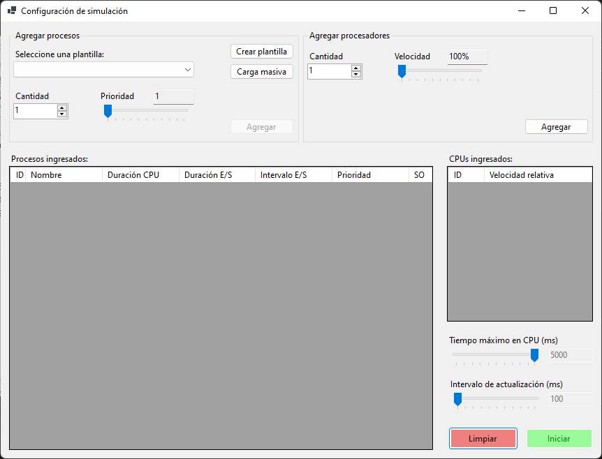
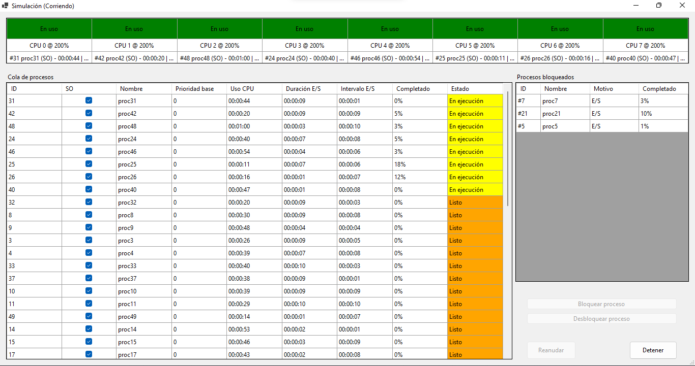

# Obligatorio_SistemasOperativos

Programa de simulacion de un planificador a corto plazo de un sistema operativo.

## Caracteristicas:

<blockquote>
Poder ingresar la cantidad de procesadores o cores. 
Poder modificar la cantidad de tiempo que los procesos se encuentran en CPU. 
Poder modificar la prioridad de los mismos en tiempo de ejecución (prioridad de 1 a 99). 
Poder bloquear un proceso en cualquier momento. 
Poder cargar (de alguna forma) múltiples procesos de un solo ingreso 
Poder insertar procesos ya sea del S.O. como de usuario indicando: 
-> Tiempo total de ejecución 
-> Cada qué tiempo realiza una E/S (periódica sin modificación) 
-> Tiempo en que espera por la E/S (puede ser diferente para cada proceso). 
</blockquote>

## Capturas

# Descarga

